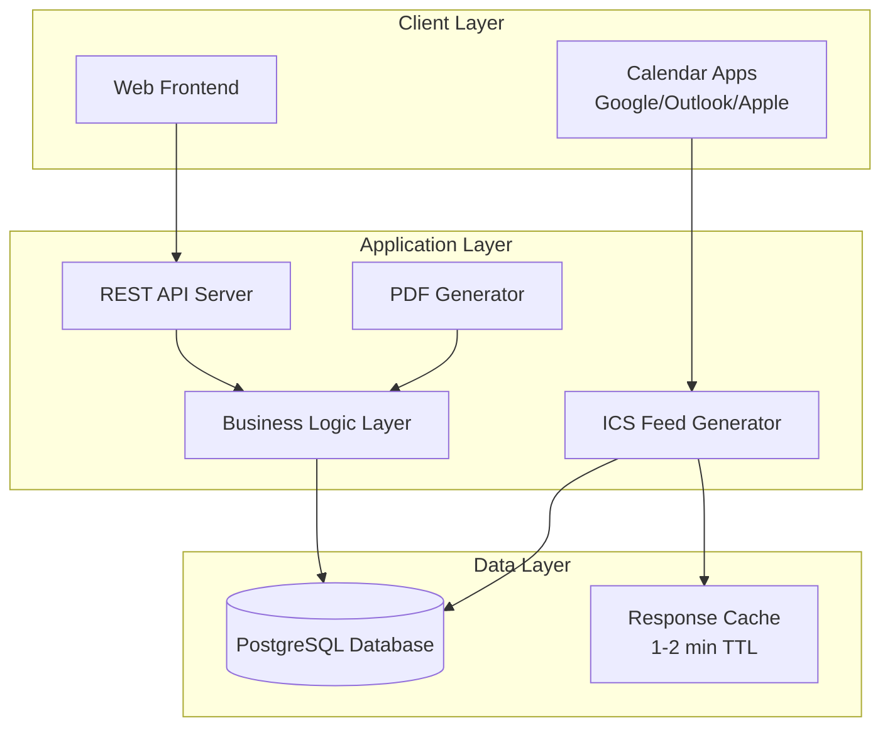

# Design Document

## Overview

The Internal Equipment Rental & Stock Management App is designed as a web-based application with a RESTful API backend and a responsive frontend interface. The system follows a layered architecture pattern with clear separation between data access, business logic, and presentation layers. The application will be deployed on internal networks without authentication requirements, using PostgreSQL for data persistence and generating ICS calendar feeds for external calendar integration.

## Architecture

### System Architecture



### Technology Stack

- **Backend**: Node.js with Express.js framework
- **Database**: PostgreSQL with connection pooling
- **Frontend**: Vanilla JavaScript with modern ES6+ features, HTML5, CSS3
- **PDF Generation**: PDFKit or similar library
- **Calendar**: Native ICS generation
- **Caching**: In-memory cache for ICS feeds
- **Deployment**: Docker containers for easy LAN/VPN deployment

## Components and Interfaces

### Core Components

#### 1. Database Access Layer (DAL)
- **Purpose**: Handles all database operations with proper connection management
- **Key Classes**:
  - `DatabaseConnection`: Connection pool management
  - `EmployeeRepository`: Employee CRUD operations with role management and activation status
  - `CustomerRepository`: Customer CRUD operations with activation status and history tracking
  - `ItemRepository`: Item and component management with BOM cycle detection
  - `OrderRepository`: Order and order line operations with availability validation
  - `StockMovementRepository`: Stock movement tracking with audit trail and reason codes
  - `CalendarTokenRepository`: Token management for secure ICS feed access

#### 2. Business Logic Layer (BLL)
- **Purpose**: Implements core business rules and calculations
- **Key Classes**:
  - `InventoryService`: Stock calculations for atomic and composite items with availability validation
  - `OrderService`: Order lifecycle management, status transitions, and conflict prevention
  - `StockMovementService`: Automatic and manual stock movement creation with audit trails
  - `AvailabilityService`: Real-time availability calculations and reservation conflict detection
  - `ValidationService`: Business rule validation, cycle detection, and role-based permissions
  - `EmployeeService`: Employee management with role enforcement and activation status
  - `CustomerService`: Customer management with activation status and order history

#### 3. API Layer
- **Purpose**: RESTful endpoints for frontend communication
- **Key Routes**:
  - `/api/employees` - Employee management with role-based operations and activation status
  - `/api/customers` - Customer management with activation status and order history
  - `/api/items` - Item and component management with availability queries and BOM operations
  - `/api/orders` - Order operations with availability validation and status transitions
  - `/api/stock-movements` - Stock movement history and manual adjustment operations
  - `/api/calendar` - Calendar token management for secure ICS access
  - `/calendar.ics` - ICS feed generation with caching and token validation

#### 4. Frontend Components
- **Purpose**: User interface for system interaction
- **Key Modules**:
  - `ItemManager`: Inventory management interface with atomic/composite indicators and availability display
  - `OrderManager`: Order creation and management with real-time availability validation
  - `CustomerManager`: Customer information management with activation status and order history
  - `EmployeeManager`: Employee directory management with role assignment and activation controls
  - `StockMovementView`: Stock movement history display with audit trail and filtering
  - `CalendarView`: Order calendar visualization with status-based color coding
  - `ReportGenerator`: PDF receipt generation interface with order details and customer information

## Data Models

### Core Entities

#### Item Model
```javascript
class Item {
  constructor(id, name, sku, pricePerDay, isComposite, quantityOnHand) {
    this.id = id;
    this.name = name;
    this.sku = sku;
    this.pricePerDay = pricePerDay;
    this.isComposite = isComposite;
    this.quantityOnHand = quantityOnHand; // null for composite items
    this.components = []; // ItemComponent[]
  }
  
  calculateAvailableQuantity(reservedQuantities = {}) {
    if (!this.isComposite) {
      return this.quantityOnHand - (reservedQuantities[this.id] || 0);
    }
    
    // For composite items: min(floor(available(child)/qty_required))
    return Math.min(...this.components.map(component => 
      Math.floor(component.childItem.calculateAvailableQuantity(reservedQuantities) / component.quantity)
    ));
  }
}
```

#### Employee Model
```javascript
class Employee {
  constructor(id, fullName, email, phone, role, isActive) {
    this.id = id;
    this.fullName = fullName; // Required
    this.email = email; // Optional
    this.phone = phone; // Optional
    this.role = role; // Admin, Staff, ReadOnly
    this.isActive = isActive; // For deactivation without data loss
  }
  
  canPerformMutatingOperations() {
    return this.isActive && (this.role === 'Admin' || this.role === 'Staff');
  }
  
  canViewData() {
    return this.isActive; // All active employees can view data
  }
}
```

#### Customer Model
```javascript
class Customer {
  constructor(id, displayName, organization, contactInfo, billingInfo, isActive) {
    this.id = id;
    this.displayName = displayName; // Required
    this.organization = organization; // Optional
    this.contactInfo = contactInfo; // Optional object with email, phone, address
    this.billingInfo = billingInfo; // Optional billing details
    this.isActive = isActive; // For deactivation while preserving history
  }
  
  canCreateNewOrders() {
    return this.isActive;
  }
}
```

#### Order Model
```javascript
class Order {
  constructor(id, customerId, salesPersonId, status, startDate, returnDueDate) {
    this.id = id;
    this.customerId = customerId;
    this.salesPersonId = salesPersonId;
    this.status = status; // Draft, Reserved, Checked Out, Returned, Cancelled
    this.startDate = startDate;
    this.returnDueDate = returnDueDate;
    this.orderRows = []; // OrderRow[]
    this.discountAmount = 0;
    this.taxAmount = 0;
  }
  
  calculateTotalWorth() {
    const subtotal = this.orderRows.reduce((sum, row) => sum + row.lineTotal, 0);
    return subtotal - this.discountAmount + this.taxAmount;
  }
  
  getRentalDays() {
    return Math.ceil((this.returnDueDate - this.startDate) / (1000 * 60 * 60 * 24));
  }
}
```

#### Stock Movement Model
```javascript
class StockMovement {
  constructor(itemId, orderId, delta, reason, createdBy) {
    this.itemId = itemId;
    this.orderId = orderId; // null for manual adjustments
    this.delta = delta; // positive for returns/adjustments in, negative for checkouts/adjustments out
    this.reason = reason; // checkout, return, adjustment, repair, loss, reserve, release
    this.createdBy = createdBy; // Free-text format for person making the change
    this.createdAt = new Date();
    this.notes = null; // Optional additional details for manual adjustments
  }
  
  static getValidReasons() {
    return [
      'checkout',    // Item checked out to customer
      'return',      // Item returned from customer
      'reserve',     // Item reserved for future order
      'release',     // Reserved item released (order cancelled)
      'adjustment',  // Manual inventory adjustment
      'repair',      // Item sent for repair
      'loss',        // Item lost or damaged beyond repair
      'found'        // Item found/recovered
    ];
  }
}
```

### Business Logic Algorithms

#### Availability Validation and Conflict Detection
```javascript
function validateOrderAvailability(orderItems, startDate, returnDueDate, excludeOrderId = null) {
  const conflicts = [];
  
  for (const orderItem of orderItems) {
    const availableQuantity = calculateAvailableQuantityForPeriod(
      orderItem.itemId, 
      startDate, 
      returnDueDate, 
      excludeOrderId
    );
    
    if (availableQuantity < orderItem.quantity) {
      conflicts.push({
        itemId: orderItem.itemId,
        requested: orderItem.quantity,
        available: availableQuantity,
        period: `${startDate.toISOString().split('T')[0]} to ${returnDueDate.toISOString().split('T')[0]}`
      });
    }
  }
  
  return conflicts;
}

function calculateAvailableQuantityForPeriod(itemId, startDate, returnDueDate, excludeOrderId = null) {
  const item = getItemById(itemId);
  const baseQuantity = item.isComposite 
    ? calculateCompositeStock(item, getAllItems())
    : item.quantityOnHand;
  
  // Get overlapping reservations and checkouts
  const overlappingOrders = getOverlappingOrders(itemId, startDate, returnDueDate, excludeOrderId);
  const reservedQuantity = overlappingOrders.reduce((sum, order) => {
    const orderItem = order.orderRows.find(row => row.itemId === itemId);
    return sum + (orderItem ? orderItem.quantity : 0);
  }, 0);
  
  return Math.max(0, baseQuantity - reservedQuantity);
}
```

#### Composite Item Stock Calculation
```javascript
function calculateCompositeStock(compositeItem, allItems) {
  if (!compositeItem.isComposite) {
    return compositeItem.quantityOnHand;
  }
  
  let minAvailable = Infinity;
  
  for (const component of compositeItem.components) {
    const childItem = allItems.find(item => item.id === component.childId);
    const childAvailable = childItem.isComposite 
      ? calculateCompositeStock(childItem, allItems)
      : childItem.quantityOnHand;
    
    const possibleSets = Math.floor(childAvailable / component.quantity);
    minAvailable = Math.min(minAvailable, possibleSets);
  }
  
  return minAvailable === Infinity ? 0 : minAvailable;
}
```

#### Order Status Transition Logic
```javascript
function transitionOrderStatus(order, newStatus, createdBy) {
  const validTransitions = {
    'Draft': ['Reserved', 'Cancelled'],
    'Reserved': ['Checked Out', 'Cancelled'],
    'Checked Out': ['Returned'],
    'Returned': [],
    'Cancelled': []
  };
  
  if (!validTransitions[order.status].includes(newStatus)) {
    throw new Error(`Invalid transition from ${order.status} to ${newStatus}`);
  }
  
  // Create stock movements based on transition
  const movements = [];
  
  if (newStatus === 'Reserved' && order.status === 'Draft') {
    // Reserve stock (reduce available but don't change on_hand)
    order.orderRows.forEach(row => {
      movements.push(new StockMovement(row.itemId, order.id, -row.qty, 'reserve', createdBy));
    });
  } else if (newStatus === 'Checked Out' && order.status === 'Reserved') {
    // Convert reservation to checkout (actually reduce on_hand)
    order.orderRows.forEach(row => {
      movements.push(new StockMovement(row.itemId, order.id, -row.qty, 'checkout', createdBy));
    });
  } else if (newStatus === 'Returned') {
    // Return stock
    order.orderRows.forEach(row => {
      movements.push(new StockMovement(row.itemId, order.id, row.qty, 'return', createdBy));
    });
  } else if (newStatus === 'Cancelled' && order.status === 'Reserved') {
    // Release reserved stock
    order.orderRows.forEach(row => {
      movements.push(new StockMovement(row.itemId, order.id, row.qty, 'release', createdBy));
    });
  }
  
  order.status = newStatus;
  return movements;
}
```

## Error Handling

### Error Categories

1. **Validation Errors**: Invalid input data, business rule violations, role permission failures
2. **Availability Errors**: Insufficient stock, scheduling conflicts, reservation overlaps
3. **Authorization Errors**: Invalid admin tokens, inactive employee/customer access attempts
4. **Database Errors**: Connection issues, constraint violations, transaction failures
5. **System Errors**: PDF generation failures, ICS feed errors, cycle detection failures

### Error Response Format
```javascript
{
  "error": {
    "code": "INSUFFICIENT_STOCK",
    "message": "Not enough inventory available for the requested period",
    "details": {
      "itemId": 123,
      "requested": 5,
      "available": 3,
      "period": "2025-01-15 to 2025-01-20"
    }
  }
}
```

### Cycle Detection Algorithm
```javascript
function detectCycle(itemId, components, visited = new Set(), recursionStack = new Set()) {
  if (recursionStack.has(itemId)) {
    return true; // Cycle detected
  }
  
  if (visited.has(itemId)) {
    return false; // Already processed
  }
  
  visited.add(itemId);
  recursionStack.add(itemId);
  
  const itemComponents = components.filter(c => c.parentId === itemId);
  
  for (const component of itemComponents) {
    if (detectCycle(component.childId, components, visited, recursionStack)) {
      return true;
    }
  }
  
  recursionStack.delete(itemId);
  return false;
}
```

## Testing Strategy

### Unit Testing
- **Database Layer**: Mock database connections, test CRUD operations
- **Business Logic**: Test calculations, validations, and state transitions
- **API Endpoints**: Test request/response handling and error cases
- **Frontend Components**: Test user interactions and data display

### Integration Testing
- **Order Workflow**: End-to-end order creation, status transitions, and stock movements
- **Calendar Integration**: ICS feed generation and token validation
- **PDF Generation**: Receipt creation with various order configurations
- **Stock Calculations**: Composite item calculations with complex BOMs

### Test Data Strategy
- **Fixtures**: Predefined test data for employees, customers, and items
- **Factories**: Dynamic test data generation for various scenarios
- **Database Seeding**: Consistent test database state for integration tests

### Performance Testing
- **Load Testing**: Concurrent order creation and status updates
- **Calendar Feed Performance**: ICS generation under load with caching
- **Database Performance**: Query optimization for availability calculations
- **Memory Usage**: Composite item calculation efficiency

### Security Testing
- **Input Validation**: SQL injection prevention, XSS protection
- **Token Security**: Calendar token uniqueness and unpredictability
- **Network Security**: LAN/VPN-only access verification
- **Data Integrity**: Constraint validation and transaction consistency

## Deployment Architecture

### Container Structure
```dockerfile
# Multi-stage build for production optimization
FROM node:18-alpine AS builder
WORKDIR /app
COPY package*.json ./
RUN npm ci --only=production

FROM node:18-alpine AS runtime
WORKDIR /app
COPY --from=builder /app/node_modules ./node_modules
COPY . .
EXPOSE 3000
CMD ["npm", "start"]
```

### Environment Configuration
- **Database**: PostgreSQL connection string with connection pooling and constraint enforcement
- **Security**: Optional X-Admin-Token for write operations and role-based access control
- **Caching**: ICS feed cache TTL configuration (60-120 seconds) with automatic invalidation
- **Logging**: Structured logging for audit trails, stock movements, and debugging
- **Network**: LAN/VPN-only access configuration for internal deployment security

### Monitoring and Maintenance
- **Health Checks**: Database connectivity and application status endpoints
- **Backup Strategy**: Nightly PostgreSQL backups with retention policy
- **Log Management**: Application logs with rotation and archival
- **Performance Monitoring**: Response times and resource usage tracking